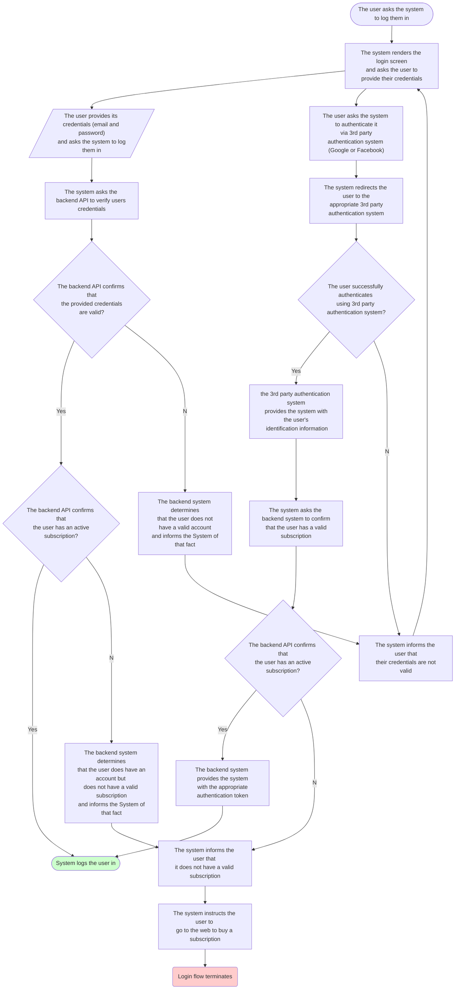
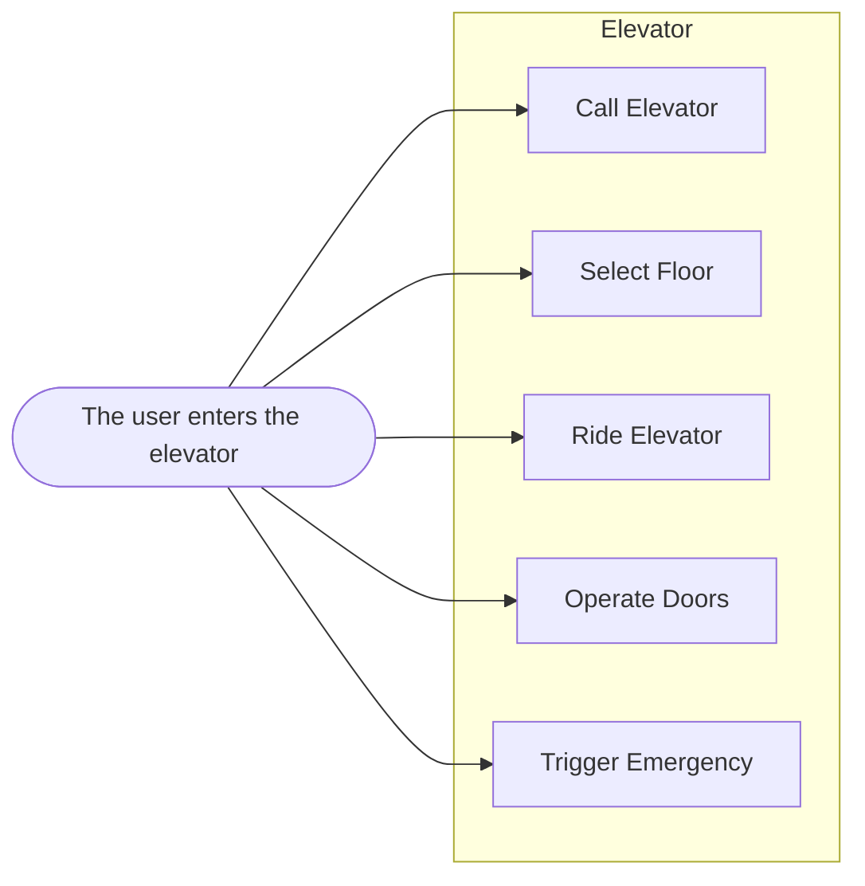
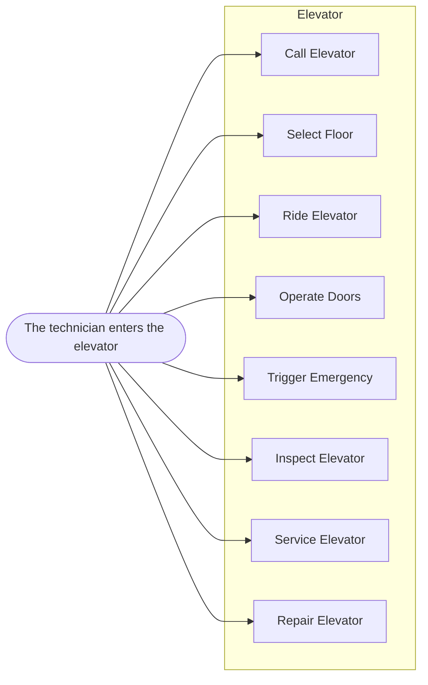

# UML Basics and Fundamental Diagram Types

## What's UML?

* Unified Modeling Language
* Graphical notation used to communicate the design of software systems
* Diagram Types
  * Use-Case Diagrams (functional diagrams)
  * Class Diagrams (structural diagrams)
  * Sequence Diagrams (dynamic/behavioral diagrams)
* It's independent of any programming language
* Diagramming lets you gain a deeper understanding of what should be implemented
* Helps us communicate ideas with other developers effectively
* Detailed diagrams are often required for Waterfall projects

## Use Case Diagrams

* Its purpose is to visualize the functional requirements of the system.
* They show groups of related use cases.
* To represent a use case, we draw an oval and put the title of the use case in it.
  * Examples: Create Trip Entry, Edit Trip, Export App Database
* We use stick figures to represent the Actors
  * Actors are human beings or other systems that interact with our system
  * Note: `actor` in mermaidjs only exist in sequence diagrams
  * Primary actors are typically labeled on the left side of the use-case diagram
  * Secondary actors are typically labeled on the right side of the use-case diagram
* We draw lines to represent interactions between actors and the ovals
* System boundaries are represented by rectangular frames
* Use case diagrams provide a clear way to communicate the high-level features and the scope of the system
  * But they don't replace use-case descriptions
    * These include more information so that important details are not missed.

Elevator Challenge:  
- What actors interact with the elevator?
- What are its main functions?
- Elevators are on duty 24/7
- Maintenance and repair is required

User role:  

Technician Role:  

## Class Diagrams

* The most frequently used UML diagram type.
* First, identify all the entities that represent the system.
* A class is represented as a rectangle with 3 compartments.
  * Class Name
    * Standard: Name should be in upper camel-case.
  * Attributes
    * Should be concise
    * Should be in lower camel-case.
    * Should include the data type.
  * Operations
    * Should be verbs in lower camer-case.
    * Can specify method arguments.
    * Can specify a return type.  

Class Diagram Challenge:  
* Create a class diagram of an elevator maintenance robot.
  * Robot must have an unique identifier
  * Robot can diagnose, service, and repair the elevator
  * Keep it simple

## Visibility: Public, Private, Protected, Package

## Associations

## Generalization

## Dependency, Aggregation, Composition and Realization

## Sequence Diagrams

## Activity Diagrams

## Statechart Diagrams

