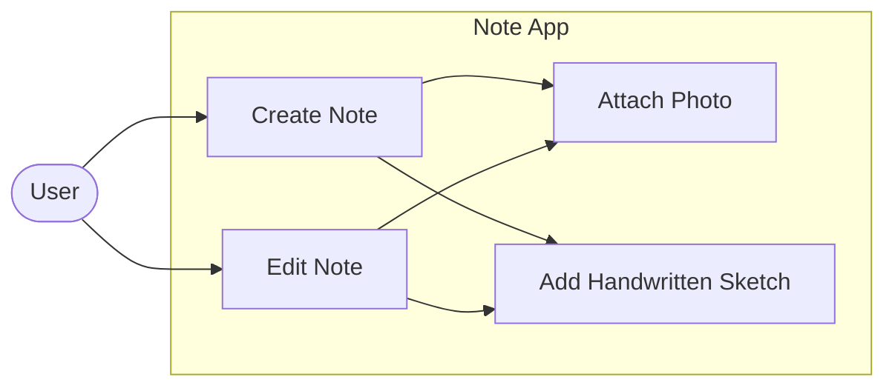
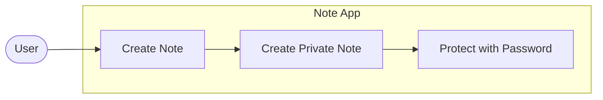
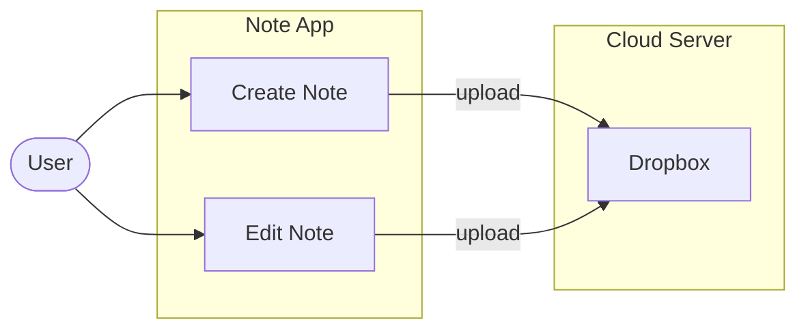
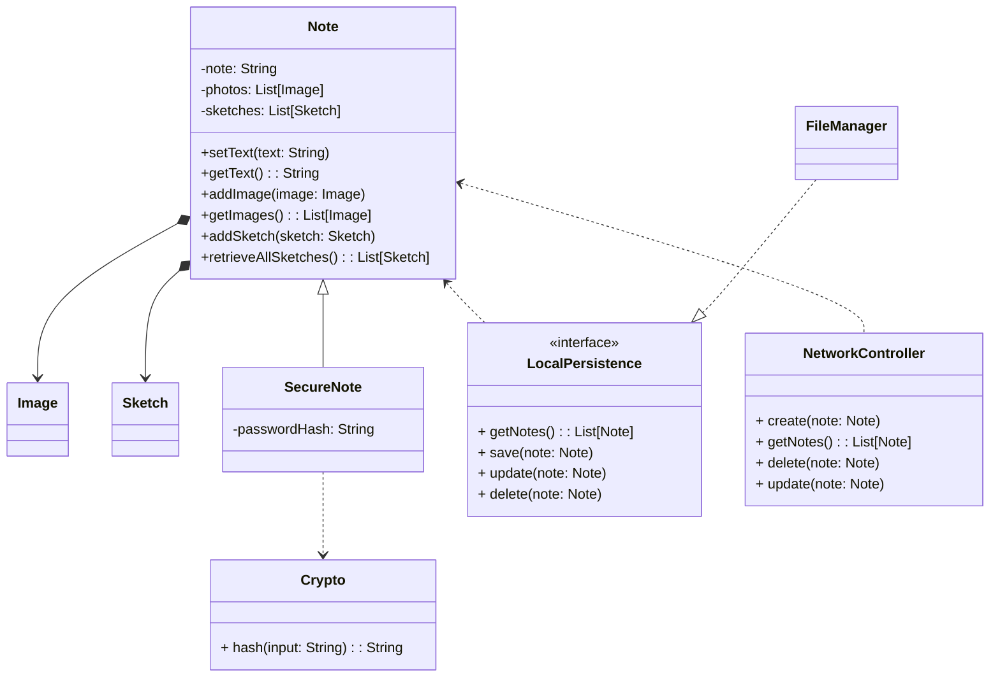
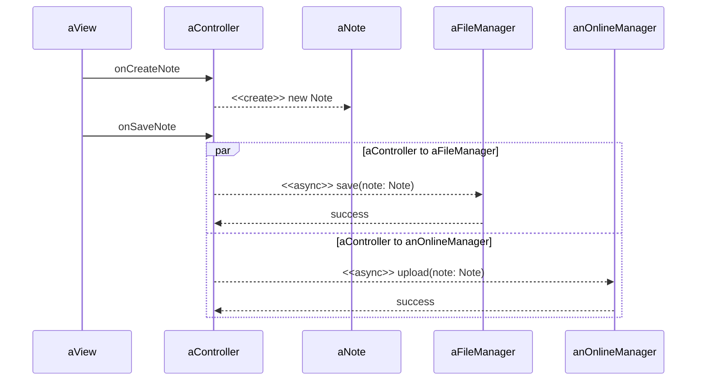
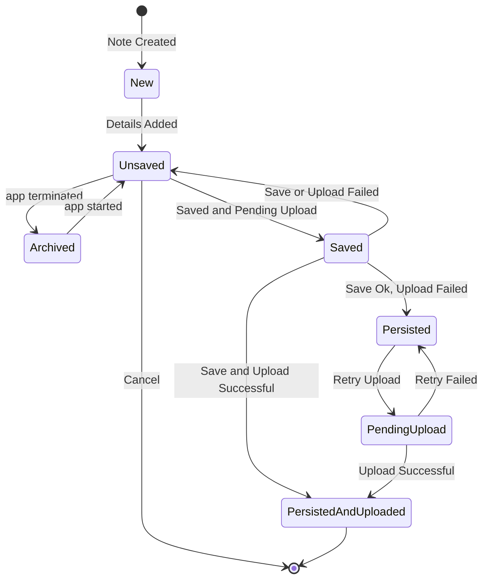

# Case Study: Designing a Note-Taking App from Scratch

* Practice by designing a Note-taking app.
* Understand the requirements
* Write User Stories
* Map User Stories to Use Case Diagrams
* Identify the main entities and relationships
* Model Behavior
* Represent object states

## Collecting Requirements

Features:  
* Create and edit text-based notes
* Attach photos/videos
* Capture hand-drawn sketches
* Password-protect individual notes
* Sync app data to Dropbox, iCloud or Google Drive

Functional Requirements:  
* We need to build a note-taking app
* Users can create and edit text-based notes
* A note may include images or hand-drawn sketches
* Sensitive notes can be protected with a password
* App can automatically upload notes to cloud storage services

Non-Functional Requirements:  
* Should be easy to use and intuitive
* Must run in the latest version of iOS
* Should handle a large number of notes
* Must be secure
* Must include support email and link to website

## Creating User Stories

From the functional requirements, we've identified 3 major topics:   
* Note creation/editing
* Privacy
* Syncing to cloud servers

Thus, we create 3 epics:  
* Note Creation and Editing
  * As a user, I want to create and edit notes so that I can quickly jot down my thoughts.
  * As a user, I want to attach photos to a note so that I can keep my memories in one place.
  * As a user, I want to add handwritten sketches so that I can insert funny toons into my notes.
* Privacy
  * As a user, I want to create private notes so that only I can access them.
  * As a user, I want to protect my sensitive notes with a password.
* Syncing to cloud servers
  * As a user, I want to sync my notes across my iOS devices so that my data is up-to-date on all of them.
  * As a user, I want my notes automatically uploaded to cloud servers (Dropbox, Google Drive, or iCloud) so that 
    I have a backup of all my data. 

## Diagramming the main use cases

Note Creation and Editing Use Case Diagram

Privacy Use Case Diagram

Syncing to Cloud Servers Use Case Diagram

## Modeling the classes and relationships

## Describing the flow of note creation using sequence diagrams

* Adding a note flow

## Modeling the states of a note object

